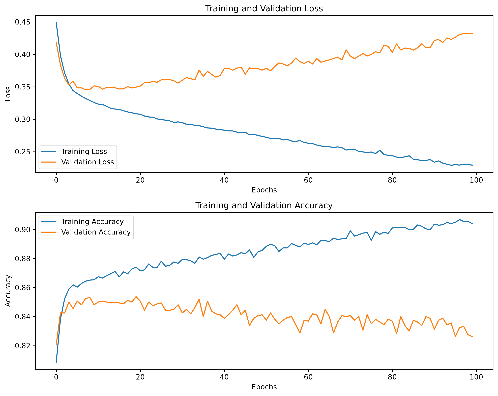

# Customer Churn Prediction using a Feedforward Neural Network (Keras)

A Deep Learning system that predicts whether a bank customer is likely to churn (leave the bank), so retention efforts can be targeted at high-risk customers.

## Problem Statement

A bank wants to reduce customer churn. Using historical customer data, this project builds a feedforward neural network that predicts the probability of a customer exiting (churning).

## Dataset

Dataset file: `Churn_Modelling.csv`

| Feature | Description |
|---|---|
| CreditScore | Customer's credit score |
| Geography | Customer's country (one-hot encoded) |
| Gender | Customer's gender (one-hot encoded) |
| Age | Customer age |
| Tenure | Years as a bank customer |
| Balance | Account balance |
| NumOfProducts | Number of bank products used |
| HasCrCard | Has a credit card (0/1) |
| IsActiveMember | Active member status (0/1) |
| EstimatedSalary | Estimated annual salary |
| Exited | Target — 0 (stayed) / 1 (churned) |

`RowNumber`, `CustomerId`, and `Surname` are dropped as identifiers with no predictive value.

## Project Structure

```
├── Training_model.py                 # Loads data, preprocesses, trains the FNN, saves model + scaler
├── Testing_model.py                  # Loads the saved model + scaler and predicts on new customers
├── Churn_Modelling.csv               # Dataset
├── credit_card_FNN_model.keras       # Trained Keras model
├── credit_card_scaler.pkl            # Fitted StandardScaler
├── training_validation_graphs.png    # Loss/accuracy curves
├── requirements.txt
└── README.md
```


## Preprocessing

- Dropped non-predictive identifier columns: `RowNumber`, `CustomerId`, `Surname`
- One-hot encoded `Geography` and `Gender` with `drop_first=True` (→ `Geography_Germany`, `Geography_Spain`, `Gender_Male`)
- 80/20 train-test split (`random_state=1`)
- Features scaled with `StandardScaler`

## Model

- Framework: TensorFlow / Keras `Sequential`
- Architecture: Dense(64, relu) → Dense(32, relu) → Dense(1, sigmoid)
- Loss: binary crossentropy
- Optimizer: Adam
- Epochs: 100, batch size: 32, validation split: 0.2

## Installation

```bash
git clone https://github.com/Avizanzane44/Python-Work.git
cd Python-Work/Deep_Learning/FNN/Churn_Model
pip install -r requirements.txt
```


## Usage

**Train the model:**
```bash
python training.py
```
This loads `Churn_Modelling.csv`, trains the network, prints accuracy/confusion matrix/classification report, saves the loss and accuracy curves as `training_validation_graphs.png`, and saves `credit_card_FNN_model.keras` and `credit_card_scaler.pkl`.

**Run predictions on new customers:**
```bash
python testing.py
```
This loads `credit_card_FNN_model.keras` and `credit_card_scaler.pkl` and prints a churn probability plus a "likely to churn" / "likely to stay" prediction for each sample customer.

### Training & Validation Curves



## Results

| Metric | Value |
|---|---|
| Test Accuracy | 84.5 % |


## Author

Name - AVISHKAR SHARAD ZANZANE 
[GitHub](https://github.com/Avizanzane44)
