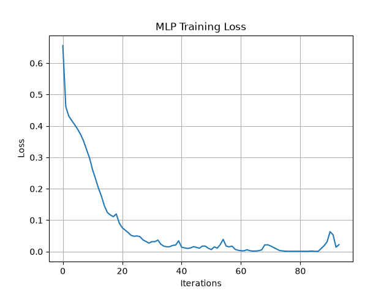

# Employee Attrition Prediction using ANN (MLPClassifier)

A Deep Learning system that predicts whether an employee is likely to leave a company, so HR can identify at-risk employees and intervene early.

## Problem Statement

A software company is experiencing high employee turnover. Management wants an intelligent system, built from historical HR data, that can identify employees who are likely to leave (attrition).

## Dataset

| Feature | Description |
|---|---|
| Age | Employee age |
| MonthlyIncome | Monthly salary |
| YearsAtCompany | Experience in current company |
| TotalWorkingYears | Total professional experience |
| DistanceFromHome | Distance from home to office |
| JobSatisfaction | Rating from 1–4 |
| WorkLifeBalance | Rating from 1–4 |
| OverTime | Yes/No |
| NumCompaniesWorked | Previous companies |
| TrainingTimesLastYear | Number of trainings |
| Attrition | Target — Yes/No |

## Project Structure

```
├── Model_Training.py                # Loads data, preprocesses, trains the ANN, saves model + scaler
├── Model_Testing.py                 # Loads the saved model + scaler and predicts on new employees
├── Employee_Attrition.csv     # Dataset
├── employee_mlp_model.pkl     # Trained MLPClassifier
├── employee_scaler.pkl        # Fitted StandardScaler
├── training_loss.png          # Training loss curve plot
├── requirements.txt
└── README.md
```


## Preprocessing

- `OverTime`: mapped Yes/No → 1/0
- `Attrition` (target): mapped Yes/No → 1/0
- 70/30 stratified train-test split (`stratify=y`, `random_state=42`) to keep the attrition ratio balanced across both sets
- Features scaled with `StandardScaler`

## Model

- Algorithm: `MLPClassifier` (scikit-learn)
- Hidden layers: (88, 66, 44, 22, 11, 2)
- Activation: relu
- Solver: adam, adaptive learning rate (`learning_rate_init=0.001`)
- Batch size: 256
- Max iterations: 1000

## Installation

```bash
git clone https://github.com/Avizanzane44/Python-Work.git
cd Python-Work/Deep_Learning/FNN/Employee_Model
pip install -r requirements.txt
```


## Usage

**Train the model:**
```bash
python training.py
```
This loads `Employee_Attrition.csv`, trains the ANN, prints accuracy/confusion matrix/classification report, saves the training loss curve as `training_loss.png`, and saves `employee_mlp_model.pkl` and `employee_scaler.pkl`.

**Run predictions on new employees:**
```bash
python testing.py
```
This loads `employee_mlp_model.pkl` and `employee_scaler.pkl` and prints a Yes/No attrition prediction for each sample employee.

### Training Loss Curve



## Results

| Metric | Value |
|---|---|
| Training Accuracy |  99.57142857142857 % |
| Testing Accuracy |  95.43333333333334 % |


## Author

Name - AVISHKAR ZANZANE
[GitHub](https://github.com/Avizanzane44)
