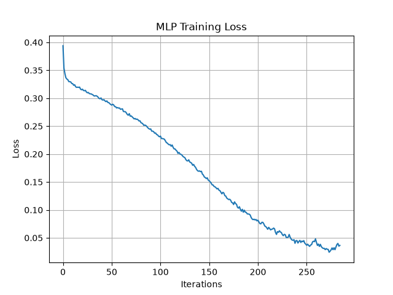

# Loan Default Prediction using ANN (MLPClassifier)

A Deep Learning system that predicts whether a bank loan applicant has a high probability of defaulting, so the bank can assess risk before approving a loan.

## Problem Statement

A bank provides personal loans to customers, and some customers fail to repay them. This project builds a model that takes an applicant's profile and predicts the probability of default, using an Artificial Neural Network (Multi-Layer Perceptron).

## Dataset

| Feature | Description |
|---|---|
| Age | Applicant age |
| Income | Annual income |
| LoanAmount | Requested loan amount |
| CreditScore | Credit score |
| EmploymentYears | Years employed |
| ExistingLoans | Number of existing loans |
| MonthlyDebt | Existing monthly debt |
| LoanTerm | Loan duration |
| PreviousDefault | Yes/No — prior default history |
| HomeOwnership | Rent/Own/Mortgage |
| Default | Target — 0 (no default) / 1 (default) |

## Project Structure

```
├── Model_Training.py      # Loads data, preprocesses, trains the FNN, saves model + scaler
├── Model_Testing.py        # Loads the saved model + scaler and predicts on new applicants
├── Loan_Dataset_10K.csv    # Dataset
├── Loan_MLP_Model.pkl      # Trained MLPClassifier
├── Loan_Scaler.pkl         # Fitted StandardScaler
├── training_loss.png       # Training loss curve plot
├── requirements.txt
└── README.md
```

## Preprocessing

- `PreviousDefault`: mapped Yes/No → 1/0
- `HomeOwnership`: mapped Own/Rent/Mortgage → 0/1/2
- 70/30 train-test split (`random_state=42`)
- Features scaled with `StandardScaler`

## Model

- Algorithm: `MLPClassifier` (scikit-learn)
- Hidden layers: (128,64,32,16,8)
- Activation: tanh
- Solver: adam, adaptive learning rate
- Max iterations: 1000


## Usage

**Train the model:**
```bash
python Model_Training.py
```
This loads `Loan_Dataset_10K.csv`, trains the ANN, prints accuracy/confusion matrix/classification report, saves the training loss curve as `training_loss.png`, and saves `Loan_MLP_Model.pkl` and `Loan_Scaler.pkl`.

**Run predictions on new applicants:**
```bash
python Model_Testing.py
```
This loads `Loan_MLP_Model.pkl` and `Loan_Scaler.pkl` and prints a High Risk / Low Risk prediction for each sample applicant.

### Training Loss Curve



## Results

| Metric | Value |
|---|---|
| Training Accuracy | 99.27 % |
| Testing Accuracy | 80.64 % |


## Author

Name - Avishkar Zanzane
